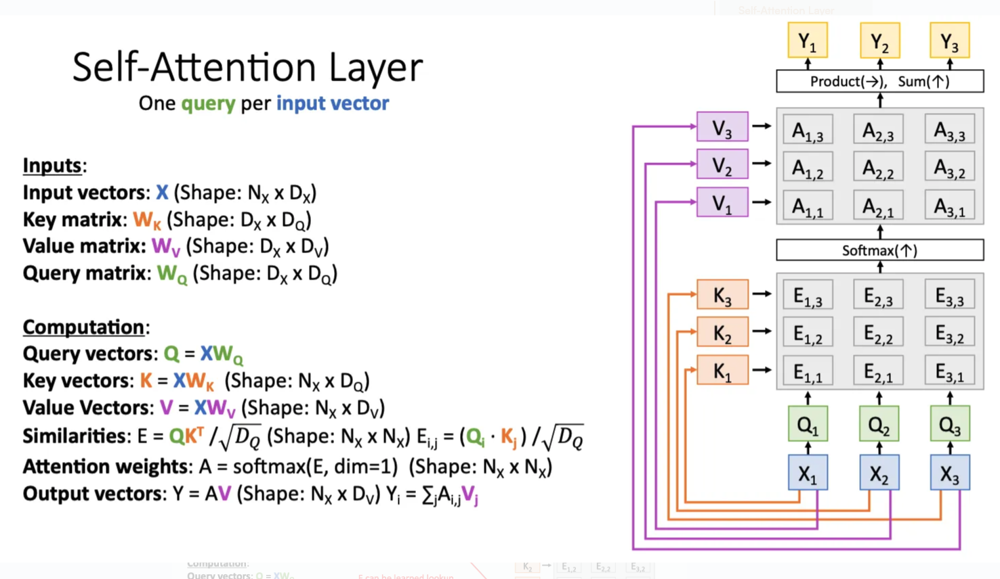

## 前言

LLMs的成功让人联想能不能把他的能力带到物理世界，于是就有VLA模型(vision language action model)。一开始的VLA的范式是自回归模型(Autoregressive)，本质上就是一个多模态的模型，就是一个VLM模型。输入视觉信息，语言指令，和机器人的状态信息然后就可以输出一系列token，这个token就是机器人下一步的动作。

但是这个token是离散的，比如将关节能动180度分成180份，然后每份对应一个token之后，根据预测出的token来让机器人动对应的角度。这是其中一种tokenization的方法，还有更高级的tokenization将更多信息，动作压缩进一个token里面，可能一个token表示整组关节的组合动作，或者把一小段连续动作压缩成一个token。从而提高动作的连贯性和降低token的预测数量。

然后这个模型是自回归的，意思就是当前的输出token取决于历史的token，就跟transformer一样，每次输出都要根据历史的token，直到最后生成完对应的token序列，也就是一个完整的动作序列。

这样就有一些问题
1. 这个token是离散的，而机器人的动作是连续的。机器人的关节可以是0-180中的任意一个数字而不只是简单只有180个。所以这就造成机器人的运动可能不够灵活
2. 还有就是我的token是自回归的，我必须等前面的token生成完才能生成下一个，计算量大，然后慢，对于一些需要瞬时反应的一些场景，机器人就不够高频率
3. 物理系统比VLM复杂，机器人有多个摄像头，还有很多传感器。然而单纯的VLM模型可能只能包含图片和文字，所以可能需要在VLM的模型架构上进行修改来适配动作信息。

于是针对前两个问题，就有人提出换个decoding，利用VLM模型的输出外加一个“动作专家”（action experts）或者“连续输出头”（continuous output heads），用于输出连续的控制。比较出名的就是diffusion prediction heads or flow-matching。用diffusion和flow-match用来连续输出。其一他们可以输出连续的数值，其二他们不像自回归，他们可以直接一次性输出所有的token。

但是这个又有问题，
- 训练变慢：这些新加的模块有很多参数，而且训练目标（loss）更复杂，所以整体训练过程往往比传统的自回归模型慢很多，需要更多时间才能收敛。
- 知识迁移变差：这些结构在微调时，模型没法很好地继承/迁移来自互联网大数据（即VLM预训练）获得的知识，导致泛化和理解能力有所下降。这种现象叫做“web data transfer降低”。本质原因也是文章想要探讨的就是这个action expert是保留了还是削弱了VLM的语义信息，他对VLA训练有什么影响

文章就告诉我们模型不听语言指令的话可能是由于action expert train from scratch，一开始的随机初始化在梯度下降的时候会污染原本预训练好的VLM的权重。

还有问题就是一开始说的VLM一开始并没有在机器人的数据里面训练，直观上来说，最简单的就是冻结VLM的预训练权重，然后只训练action expert，但是尝试之后就是表现并不好。

文章的想法就是
- π0 模型引入了“continuous action expert”，可以捕捉复杂的连续动作分布，在推理时效率高，能做高频精细控制（比如叠衣服）。但实验发现，直接对接 action expert，会导致语言理解能力下降、训练速度变慢，因为 action expert 的梯度会干扰原本预训练的 VLM（视觉语言模型）主干网络。
- π0-FAST 通过把动作用 DCT（离散余弦变换）进行分桶、离散化，用 token 表达复杂动作，可以更高效地离散动作token，但推理时还是要自回归生成（速度慢），而且这种离散方案对细腻、动态任务表现变差。
- π0.5 则先只用 FAST token 动作训练主干网络，然后在后期（post-training）引入 action expert 训练连续动作（用 joint-training 方式，主要用于移动操控任务）。这种方式相当于主干网络已经适应了机器人控制任务，再引入 action expert，但流程是两阶段的。

本论文的贡献是进一步把 π0.5 的思路“正规化”并扩展，提出一种单阶段训练方案：主干网络用离散 token 训练以获得强表达能力，同时 action expert 同步训练连续动作，但用“知识绝缘”方法保护主干网络不被 action expert 的梯度干扰。这种方式融合了两者优点——训练速度快、知识保留好、又能支持高频率的连续动作控制。

## 自回归模型

之前的自回归范式就是一个多模态的transformer架构，流程就是我一开始有多个模态(图片，文字，状态)，然后我分别用不同的encoder来处理这些模态之后得到对应的相同长度的特征向量，这些特征向量就可以当作是这个图里面的X

乘一个query matrix，key matrix之后得到query vector，key vector，然后把一部分mask掉之后就得到相似度矩阵，之后softmax就得到attention score，最后加权平均value vector得到输出。有多少个输入我就有多少个输出，我们只取动作对应的vector进行下一步操作，可能是简单的mlp根据这个动作token生成多个具体的关节之类的token，从而使机器人运动。

然后的话，我们提取出来的动作token作为新的X并入进去，再一轮计算query vector，key vector，value vector得到下一个动作token，直到结尾。所以这就是自回归，下一个动作token依赖历史的动作，随着历史token越来越多，计算的复杂度也越来越多，计算时间也就越来越慢。

每次生成一个token他就执行对应的动作，也就是边生成边执行。于是乎，机器人的延迟就在于两个token之间的计算时间。而且随着动作做的越来越多他的延迟就越来越大。

## Action expert架构

我觉得这个可以看作是两个Transformer架构的拼接，一开始我有一个VLM的Transformer，然后他有对应的$W_Q,W_K,W_V$ 然后他就输入各种模态的数据，输出就是对应的文字token和离散的动作token。

然后Action expert也是一个Transformer，他的输入就是一系列连续动作向量，也就是我们把视频里的动作切分成很多步然后对应不同的时间步，然后每一个向量里面的数值都是连续精细的小数。我们把这个经过加噪之后得到一系列对应的加噪动作向量作为这个Transformer的输入。他也有自己的$W_Q,W_K,W_V$ ，关键就在于他得到的query vector先乘他自己的key vector得到相似度分数，然后再用他的query vector去乘VLM的key vector，最后经过softmax之后分别得到两组attention score，然后乘对应的自己的Value vector和VLM的Value vector之后再加和得到最后的输出。

公式表示就是
$$
softmax(Q_a*K_a)*V_a+softmax(Q_a*K_b)*V_b
$$

然后这一部分用的是flow matching。他的过程就是

一个真实的、未来的动作块，它是一个连续向量的序列，我们称之为 `a_0_sequence = [a_0_1, a_0_2, ..., a_0_50]`。
我们生成一个形状完全相同的纯噪声序列 `noise_sequence = [ω_1, ω_2, ..., ω_50]`。
我们随机选择一个时间进度 `t` (比如 `t=0.7`)。然后，我们通过逐个向量线性插值来创建带噪声的输入序列：
- `input_vec_1 = 0.7 * ω_1 + (1 - 0.7) * a_0_1`
- `input_vec_2 = 0.7 * ω_2 + (1 - 0.7) * a_0_2`
- ...
-  `input_vec_50 = 0.7 * ω_50 + (1 - 0.7) * a_0_50`
最终输入: 我们得到了一串50个带噪声的连续向量，我们称之为 `a_t_sequence`。这**就是**即将进入Transformer的初始输入序列。

经过Transformer之后它会输出一个形状完全相同的新序列，我们称之为 `v_θ_sequence = [v_θ_1, v_θ_2, ..., v_θ_50]`。

损失函数：
$$
L_{\mathrm{FM}}=\left\|(\text{noise sequence}-a_{0_{sequence}})-v_{\theta_{sequence}}\right\|^2
$$

 - 这是一个**常量向量场**。对于序列中的每一个位置，正确的“方向”都是一样的。
    - `true_direction_1 = ω_1 - a_0_1`
    - `true_direction_2 = ω_2 - a_0_2`
    - ...
    - `true_direction_50 = ω_50 - a_0_50`
    - 我们得到了一个“标准答案”序列：`true_direction_sequence`。

-  **计算总损失**:
    - **第一步的损失**: `|| true_direction_1 - v_θ_1 ||^2`
    - **第二步的损失**: `|| true_direction_2 - v_θ_2 ||^2`
    - ...
    - **第五十步的损失**: `|| true_direction_50 - v_θ_50 ||^2`
    - **最终总损失 `L_FM` 就是所有这些损失的平均值或总和。**

核心思想就是我想要预测的是一开始没有加噪声的图片是怎么变到纯噪声的，所以我的输出是变化的方向而不是终点向量，我还要用一开始输入的加噪后的向量减去这个输出才得到一步步去噪的结果。

## Improving VLAs with co-training, joint-training & knowledge insulation

这一部分就是文章提出的解决之前问题的方法，

### Co-training & representation learning with joint discrete/continous action prediction

这一部分讲的就是联合训练，也就是VLM和action expert同时训练。具体流程就是我一开始有三种数据，
1. VLM 数据 (纯图文数据)：
    - 内容：只有图片和相关的文字描述（比如，一张猫的照片和文字“一只猫在睡觉”）。
    - 作用：这就像是给模型看“互联网”。它让模型学习海量的通用知识，理解物体、场景和概念。这是在“温故”，防止模型忘记预训练学到的知识（灾难性遗忘）。

2. 仅动作数据 (Action-only data)：
    - 内容：只有机器人的视觉输入和对应的动作序列，但没有文字指令。
    - 作用：这就像是给模型看“无声的机器人操作录像”。它让模型学习在特定视觉情境下的物理规律和动作可能性。

3. 语言与动作结合的任务 (Combined language and action prediction tasks)：
    - 内容：同时包含视觉输入、文字指令和对应的机器人动作。
    - 作用：这就像是给模型看“带解说的机器人操作视频”（比如“机器人正在拿起红色的积木”）。这是最直接的训练数据，教模型如何将语言指令与物理动作联系起来。论文提到他们通过给“仅动作数据”人工添加文字描述来创造这类数据。

然后我随机从这三种数据中抽取一个批次数据，这个批次里面包含这三种数据用来轮流训练，如果是

对于VLM来说本质上都是输入一系列的token，然后进行Teacher Forcing，只是这个token可能来自不同的模态。

- VLM数据：那么VLM模型就根据输入的图片和文字输出对应文字补全(Teacher Forcing)，然后计算交叉熵损失。然后由于这个数据不涉及动作，所以后续的action expert部分的损失就被mask掉，设为0，语言部分的mask设为1
- Action-only数据：VLM模型根据输入视频和编码动作，来预测视频中对应的动作，一样也是Teacher Forcing。一开始的动作用fast 编码，然后VLM模型就预测这个token，然后后面的action expert就输入连续动作向量预测整个连贯的动作。前面一个用交叉熵损失，后面一个用流匹配。语言部分就mask为0，动作预测mask为1，action expert部分mask为1.
- combined 数据：VLM模型输入的是视频，这个视频一开始对应的完整命令和他的编码动作，然后也是Teacher Forcing的方法让模型去预测命令和动作。一样是VLM预测动作token，expert输入连续动作向量预测连贯动作。所有部分mask为1。
$$
\mathcal{L}_{\mathrm{CO-VLA}}(\theta)=\mathbb{E}_{\mathcal{D},\tau,\omega}\left[-\sum_{j=1}^{n-1}M_j^\ell\log p_\theta(\hat{\ell}_{j+1}|x_{1:j})+\alpha M^{\mathrm{act}}\left\|\omega-a_{1:H}-f_\theta^a(a_{1:H}^{\tau,\omega})\right\|^2\right]
$$
$M^\ell$ is a language loss mask (indicating locations in the token stream at which the language loss should be applied) and $M^{act}$ is an action mask indicator specifying whether or not actions should be predicted for the given example.

上述讲的都是这个模型的训练过程，等到模型的推理的时候，一开始输入图片和完整命令，然后VLM模型就可以计算他对应的key vector和value vector。Action expert就输入存噪声进去，然后计算他对应的query vector，key vector和value vector。然后进行之前提到的交叉注意力，得到方向向量，然后和一开始的纯噪声相加后再次作为新的输入，输入到action expert中，不断迭代这个过程，最后逐渐去噪，得到对应的动作命令。

于是乎相比于自回归架构，我的action expert计算之后可以一次性得到所有的输出，这样大大降低他的延迟。

### Knowledge insulation & gradient flow

这里就是梯度阻断，就是
$$
softmax(Q_a*K_a)*V_a+softmax(Q_a*K_b)*V_b
$$
后半部分的$softmax(Q_a*K_b)*V_b$的损失不回传给VLM的模型