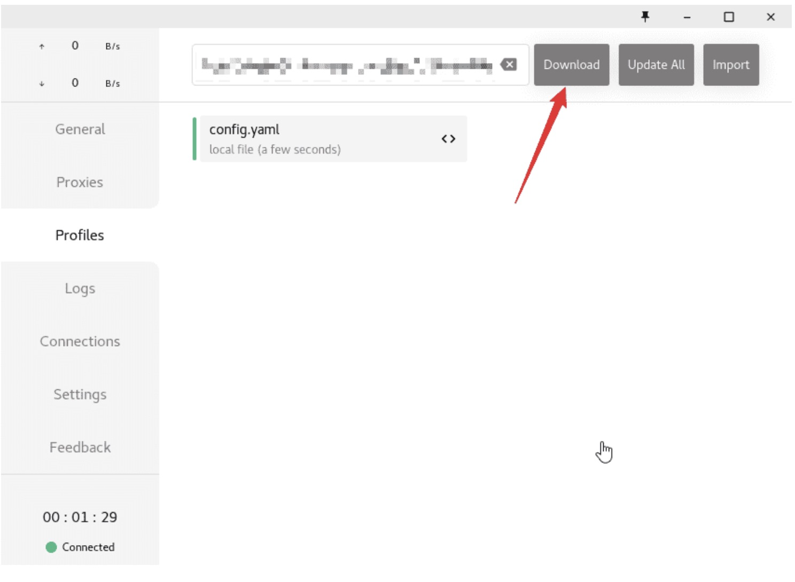
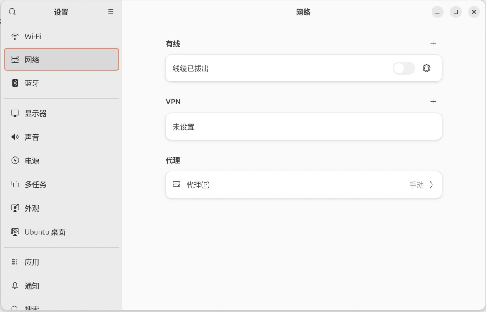
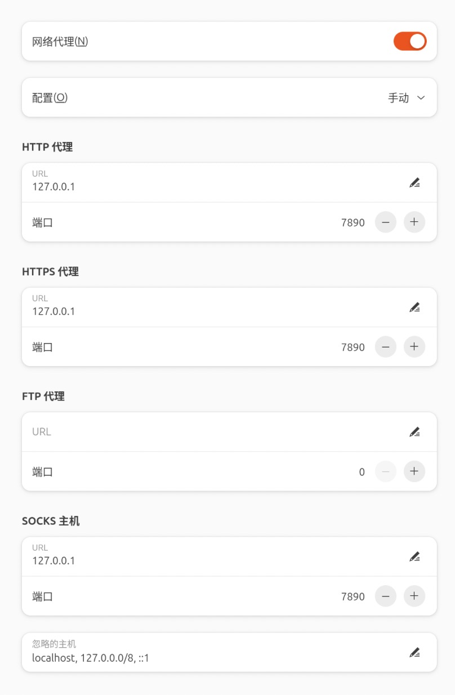
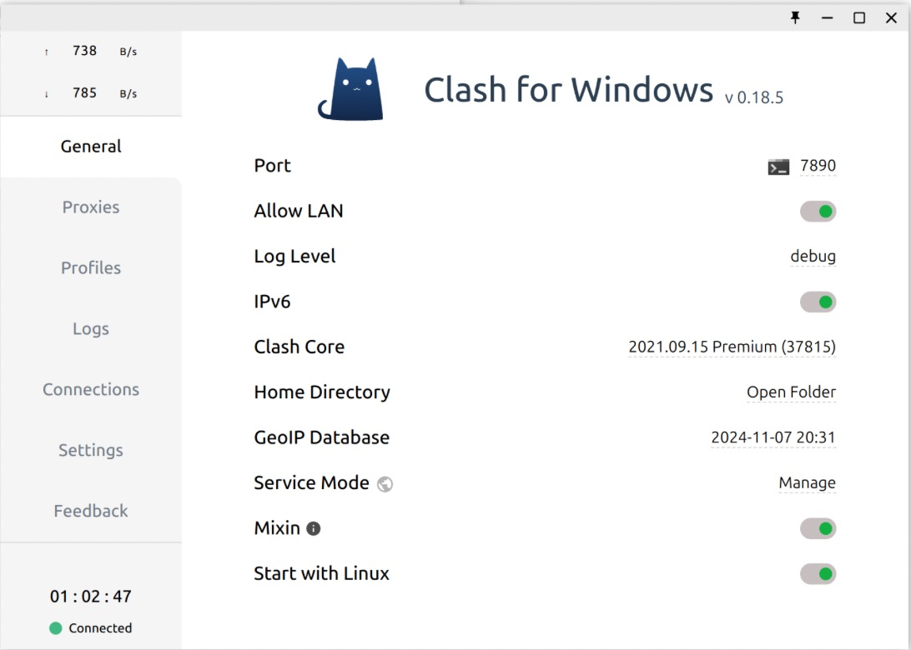

本博客基于这个[博客](https://docs.gtk.pw/contents/linux/linux-clash-gui.html#下载)

上面的博客已经讲的非常清晰

本博客只是在此基础上补充些细节

## 设备
x86架构 ubuntun24

## 下载
- [box](https://app.box.com/s/my3vtk7cxefp7v69vsnzg3kebehqba1x/folder/211969947230)

根据电脑的架构下载对应的版本

但是根据自己的经验似乎这个网址本身就是要vpn才能连接

linux下好像是无法打开这个网址的

如果是这样的话，建议用另外一台可以登上这个网址的电脑先下载这个文件，然后将文件传给linux

这里我们用scp(基于ssh的安全传输方式)
```shell
scp file.txt user@remote_host:/home/user/
```
file.txt就是要传输的那个文件

user@remote_host就是要传输的那台电脑

对于小白而言，user其实就是主机名，可以打开linux终端，输入

```shell
whoami
```
来查看主机名

对于remote_host就是要传输对象的ip地址

可以用
```shell
ip addr show
```
进行查看,一般就在wlo1那里查看，一般长10.xx...之类的就是

## 配置
当你成功传输之后，打开tar文件，图形化界面直接就帮你解压，不行就tar命令

进入文件中之后就直接点击cfw文件，然后他就有clash的图形化界面

点击左边`profiles`，在搜索栏输入购买流量的url（流量当然是购买来的），然后按个回车就能导入

订阅成功之后就选中刚刚导入的内容

## 设置系统代理
由于 Clash for Windows 的系统代理功能只在 Windows 和 macOS 下生效，所以在 Linux 下需要手动设置系统代理。

在系统设置中，找到网络设置。

点开代理

打开，然后选择手动

按图中配置

127.0.0.1是本地主机号，7890是clash选择的端口号
| | |
|-------|-------|
|  |  |


自己可以在proxies选择不同的流量

打开`Allow lan`就可以使用