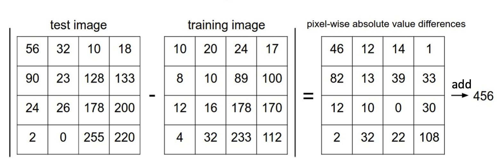
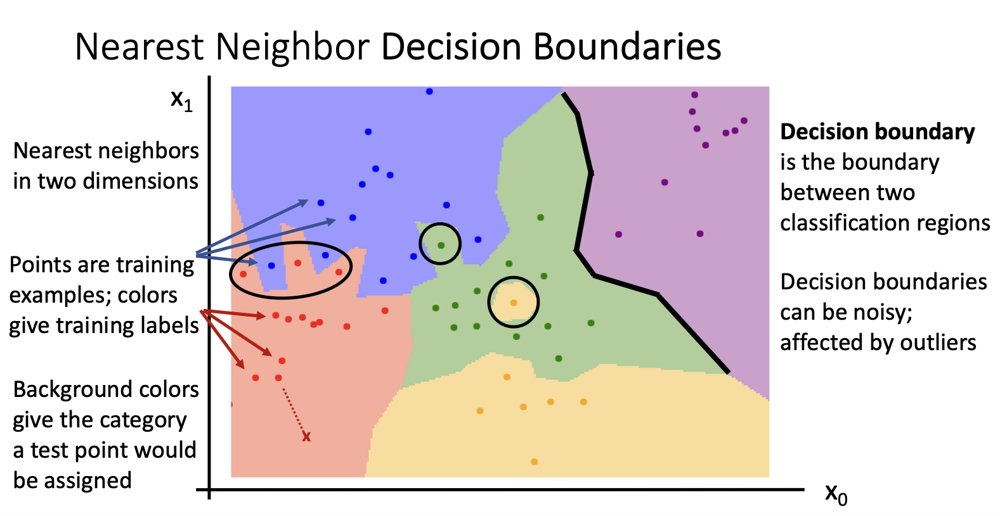
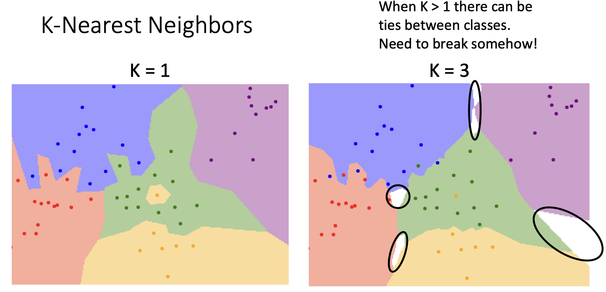
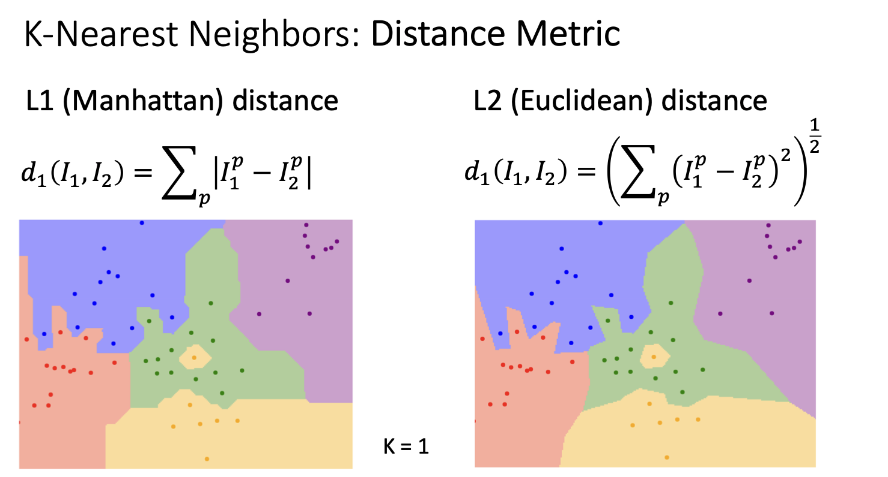
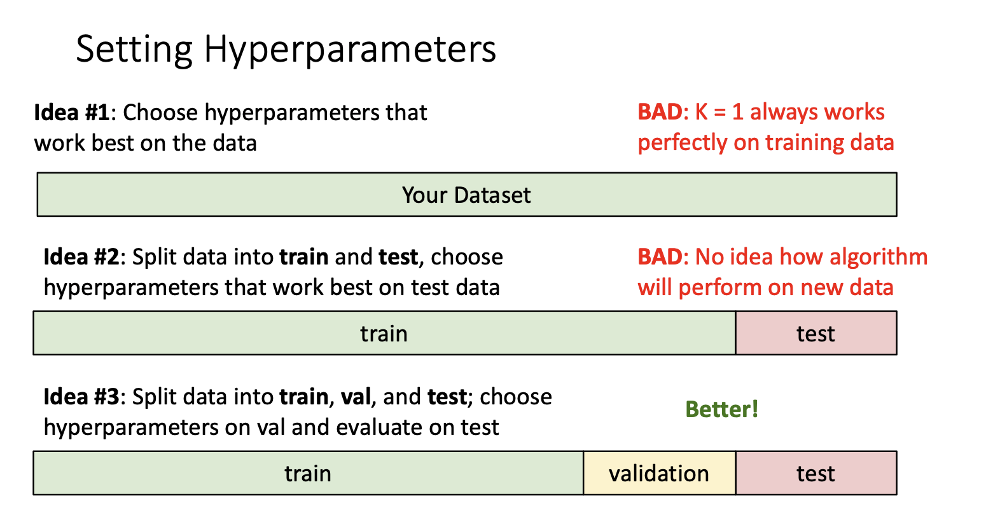
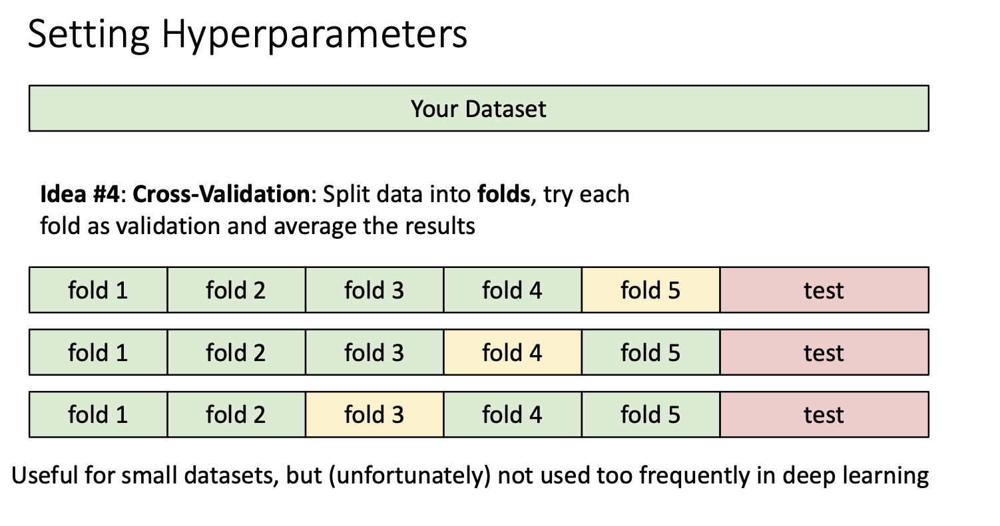

一个机器学习的算法通常包括两部分：
训练部分
```python
def train(images,labels):
#machine learing
	return model
```
预测部分：
```python
def predict(model,test_images):
#Use model to predict labels
	return test_labels
```

---

## Nearest Neighbor算法

- train部分只是单纯的记住每个训练过的图片和相应的标签
- predict部分就是将输入的图片和记住的图片通过某些**比较算法**来比较，找到最相似的图片，输出相应的标签

那这个**比较函数**可以是什么
### L1 distance
$$d_1(I_1,I_2)=\sum_p |I_1^p-I_2^p|$$



这种算法的训练复杂度是O(1)我们只是需要那个训练集就可以，但是测试复杂度是O(n)
*这样其实是非常不好的，这和机器学习的预期完全相反，我们希望能花更多的时间来训练，然后更快的时间来完成测试。*

同时这种算法并不能“真正”的理解图片的内容，因为他是根据图片时间的像素差距来判断，所以通常如果两张照片有相同的颜色，形态之类的他都会误以为是同一种，即使他们是不同的生物

---
## 进阶(KNN)
我们将训练集中的每一个图片根据某种特征提取出特征值出来，然后用相应的颜色表示对应的标签，然后放入坐标轴中。我们就得到一张具有离散的不同颜色的点，这些点形成区间。

*具体这些离散的点怎么形成呢，可能是当我们把训练集中的所有图片转化为点放到坐标轴上的时候，他就会通过比较函数计算坐标轴中剩余的点，然后给定他的标签，从而实现离散的点到连续的区间。*


然后当测试的时候，我们同样将图片转化成点放入图中，直接判断他在那个区间，然后判断出他的标签。

但是如果我们判断点的标签的时候只依据和他最近点的坐标的话，那这个图将不会有鲁棒性，很容易受到噪声的影响，从而让图变得有锯齿以及孤立的区间（图中绿色里面的黄色）

**但是KNN的核心就是每个点不依赖单独一个点，而是找到K个最近的点，然后和这些点中大多数的一样标签一样。这样的可以使图像变得平滑（从左图变到右图）**

这种做法会造成出现白色区域，因为这些区域的点到其他的区域都差不多近，这时就额外处理，比如遇到这种情况就选最近的就行了。

## Distance Metric(距离度量)
所谓的比较函数，更科学叫做Distance Metric(距离度量)，用于测量两点之间的差异。除了上面提到的,我们还有L2(Euclidean distance)
$$d_2(I_1,I_2)=\sqrt{ \sum_p (I_1^p-I_2^p)^2}$$
有趣的是当我们分别用两种方式来画图的时候，L1的边缘更直角化，而L2则更圆滑。具体的数学原理暂时先留着。



那该怎么选择距离度量呢？引用chatgpt
***Distance Metric** 是用来衡量两点（或两对象）间差异的核心工具。选择合适的距离度量对于算法的性能至关重要，通常根据数据的特性和问题的背景来选择：*
- 连续数据：欧几里得、曼哈顿。
- 离散数据：汉明距离。
- 高维或方向数据：余弦距离。
---
## Hyperparameters(超参数)
所以对于这种算法，我们该选多大的K，该选什么样的距离度量，这些都属于超参数。但是对于每一类问题，他们的超参数是不同的且没有有效的办法来预先知道这些超参数，所以一般都是尝试不同的超参数，然后判断哪种效果好。

### 设置超参数
那么我们怎么设置超参数和怎么评价效果的好坏


我们需要做的就是将我们的数据集拆分成三份，一份用来训练，一份用来验证，根据这个来调整我们的超参数，最后一份当我们调整完成我们的算法的时候来测试我们算法的准确性，用完即弃。


最好的做法就是将算法拷贝多次，每次将不同的fold作为验证集，来得到不同的超参数，然后选准确率高的。但这种做法一般适用小模型，因为训练的成本会很贵。


