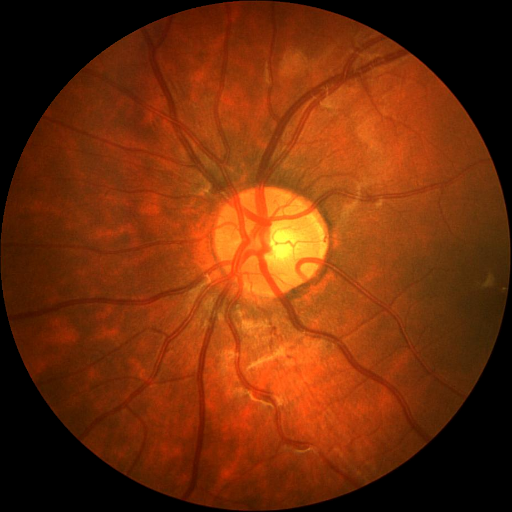
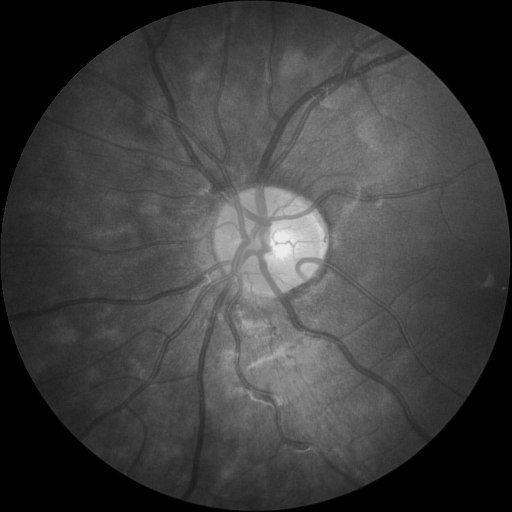
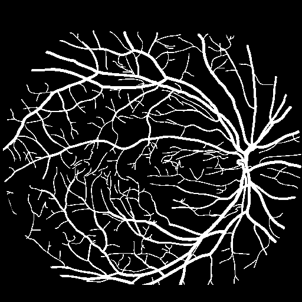
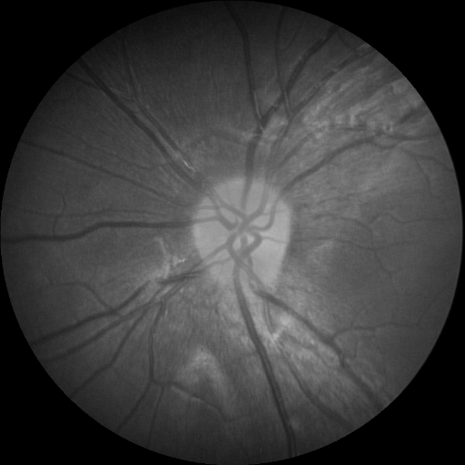
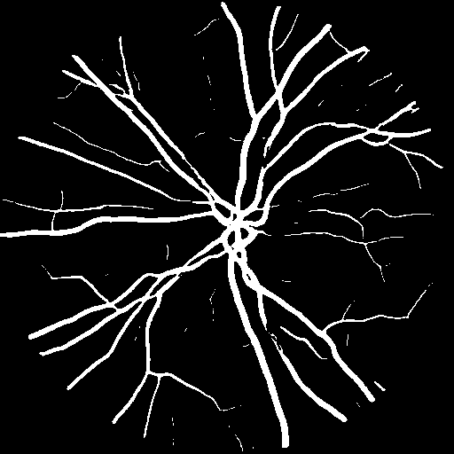
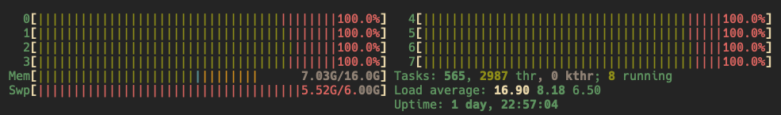

## 引言

最近要用nnUNet来处理医学图像，准确来说叫图像分割。简单来说就是训练一个模型，使之给定他一个图片，他能够将图片的血管分割出来。此次使用的工具是[nnUNet](https://github.com/MIC-DKFZ/nnUNet?tab=readme-ov-file)，nnUNet是一个自适应的深度学习框架，专为医学图像分割任务设计。他的最大的特点就是自动化，他自动训练训练集，自动预训练，自动评判。简而言之，他就是一个功能多样且强大，封装好的医学图像分割工具。

所以本次博客主要记录一下如何使用nnUNet进行训练。

## 配置

- mac m1 pro 16 + 512


## 配置环境

一开始我们要clone nnUNet的仓库到我们的本地，当然也可以不用，要是没有需求修改他们的模型就不用。
但这里我clone了

```shell
git clone https://github.com/MIC-DKFZ/nnUNet.git
cd nnUNet
```

然后建议用conda或者其他的来管理python包这里要安装的还挺多的

```shell
pip install -e .
```

是用于在当前目录下以“可编辑模式”（editable mode）安装 Python 包的命令。具体来说，这个命令会查找当前目录中的 `setup.py`（或者 `pyproject.toml`），并将包安装到 Python 环境中，但不是把文件复制过去，而是建立一个指向源代码的链接。这意味着当你修改源码时，无需重新安装，修改会立即生效，非常适合开发调试阶段。


## 数据处理

[官方文档](https://github.com/MIC-DKFZ/nnUNet/blob/master/documentation/dataset_format.md)

我一开始拿到的数据集其实并不是按照nnUNet标准要求的数据格式来存放的。以下是我一开始数据集的结构图。我一开始有两个数据集，每个数据集的格式都是如此

```
/path/to/your_dataset_1/
 |——crop                          
 |——crop_test
 |——crop_train                    
 |   |——0
 |      |——image.png
 |      |——label.png
 |      |——mask.png
 |   |——1
 | …
 |——original                      
```

- original：存放原始图片，用于以防万一后续检查
- crop：切割后的图片，就是将原始图片进行裁切，放大我们想要关注的区域
- crop_train：他和crop_test平分crop中的图片，一半用于训练，一半用来训练完之后的检验。然后这个数据有0，1，2, ....个文件夹，里面存的image.png, label.png, mask.png
	- image.png 切割后的图片
	- label.png 标签，就是人工标注的分割结果，用于训练和检测
	- mask.png 测试的时候防止预测区域外干扰使用的
- crop_test 结构和crop_train一样

但可惜的是，nnUNet支持的格式并不是这种, 数据集必须位于 `nnUNet_raw` 文件夹中（你可以在安装 nnU-Net 时定义该文件夹，或在每次运行 nnU-Net 命令时导出/设置该路径）。每个分割数据集都作为一个独立的“Dataset”存储，并关联一个数据集 ID（一个三位整数）和一个你自定义的数据集名称。例如，Dataset005_Prostate 的名称为 “Prostate”，其数据集 ID 为 5。数据集在 `nnUNet_raw` 文件夹中的组织结构如下：

```
nnUNet_raw/
├── Dataset001_BrainTumour
├── Dataset002_Heart
├── Dataset003_Liver
├── Dataset004_Hippocampus
├── Dataset005_Prostate
├── ...
```

在每个数据集文件夹内，期望的结构如下：

```
Dataset001_BrainTumour/
├── dataset.json
├── imagesTr
├── imagesTs  # 可选
└── labelsTr
```

- **imagesTr**：存放训练样本的图像。nnU-Net 会基于这些数据进行管道配置、交叉验证训练、后处理以及寻找最佳集成策略。
- **imagesTs**（可选）：存放测试样本的图像。nnU-Net 不会使用它们，仅作为一个便于存储的目录，这是 MSD 文件夹结构的遗留部分。
- **labelsTr**：存放训练样本的真实分割图。
- **dataset.json**：包含数据集的元数据信息。

上述方案将产生如下文件夹结构。以下以 MSD 的第一个数据集 BrainTumour 为例，该数据集有四个输入通道：FLAIR（0000）、T1w（0001）、T1gd（0002）和 T2w（0003）。注意，imagesTs 文件夹为可选。

```
nnUNet_raw/Dataset001_BrainTumour/
├── dataset.json
├── imagesTr
│   ├── BRATS_001_0000.nii.gz
│   ├── BRATS_001_0001.nii.gz
│   ├── BRATS_001_0002.nii.gz
│   ├── BRATS_001_0003.nii.gz
│   ├── BRATS_002_0000.nii.gz
│   ├── BRATS_002_0001.nii.gz
│   ├── BRATS_002_0002.nii.gz
│   ├── BRATS_002_0003.nii.gz
│   ├── ...
├── imagesTs
│   ├── BRATS_485_0000.nii.gz
│   ├── BRATS_485_0001.nii.gz
│   ├── BRATS_485_0002.nii.gz
│   ├── BRATS_485_0003.nii.gz
│   ├── BRATS_486_0000.nii.gz
│   ├── BRATS_486_0001.nii.gz
│   ├── BRATS_486_0002.nii.gz
│   ├── BRATS_486_0003.nii.gz
│   ├── ...
└── labelsTr
    ├── BRATS_001.nii.gz
    ├── BRATS_002.nii.gz
    ├── ...
```

下面是 MSD 第二个数据集的另一个示例，该数据集只有一个输入通道：

```
nnUNet_raw/Dataset002_Heart/
├── dataset.json
├── imagesTr
│   ├── la_003_0000.nii.gz
│   ├── la_004_0000.nii.gz
│   ├── ...
├── imagesTs
│   ├── la_001_0000.nii.gz
│   ├── la_002_0000.nii.gz
│   ├── ...
└── labelsTr
    ├── la_003.nii.gz
    ├── la_004.nii.gz
    ├── ...
```
注意：nnUNet version 2 已经不止支持nii.gz格式，包括png等的很多格式都已经支持，具体可以看他们的[官方文档](https://github.com/MIC-DKFZ/nnUNet/blob/master/documentation/dataset_format.md)

所以我们要做的就是将数据集中的crop_train中的训练图片和label分出来，存到对应的文件夹中。此外我们还要根据我们的数据写dataset.json文件。

脚本如下：

```python
import os  
import shutil  
from batchgenerators.utilities.file_and_folder_operations import maybe_mkdir_p, save_json  
from PIL import Image  
import numpy as np  
  
  
def organize_dataset(input_dir, output_dir, is_label=False):  
    for case in os.listdir(input_dir):  
        case_dir = os.path.join(input_dir, case)  
        if os.path.isdir(case_dir):  
            image_file = os.path.join(case_dir, 'image.png')  
            label_file = os.path.join(case_dir, 'label.png') if is_label else None  
  
            # Copy image to output directory  
            if label_file is None:  
                img = Image.open(image_file).convert("L")  
                img.save(os.path.join(output_dir, f'{case}_0000.png'))  

  
            if is_label:  
                label_image = Image.open(label_file)  
                label_array = np.array(label_image)  
                label_array[label_array == 255] = 1  
                converted_label_image = Image.fromarray(label_array)  
                converted_label_image.save(os.path.join(output_dir, f'{case}.png'))  
  

def main():  
    # base_dir = '/Path/to/your/dataset/crop_train'  
    base_dir = '/Path/to/your/dataset/crop_train'  
    # test_dir = '/Path/to/your/dataset/crop_test'  
    test_dir = '/Path/to/your/dataset/crop_test'  
    # nnunet_raw_dir = '/Path/to/nnUNet_raw/Dataset001_****'  
    nnunet_raw_dir = '/Path/to/nnUNet_raw/Dataset001_****'  
    imagesTr_dir = os.path.join(nnunet_raw_dir, 'imagesTr')  
    labelsTr_dir = os.path.join(nnunet_raw_dir, 'labelsTr')  
    imagesTs_dir = os.path.join(nnunet_raw_dir, 'imagesTs')  
  
    maybe_mkdir_p(imagesTr_dir)  
    maybe_mkdir_p(labelsTr_dir)  
    maybe_mkdir_p(imagesTs_dir)  
  
    organize_dataset(base_dir, imagesTr_dir)  
    organize_dataset(base_dir, labelsTr_dir, is_label=True)  
    organize_dataset(test_dir, imagesTs_dir)  
if __name__ == '__main__':  
    main()
```

值得注意的是，这里面还有一些细节。一开始我们的图片都是有色的，意味着我们的图片每个像素都有三个参数RGB，在nnUNet中就表示多通道，但是我训练的时候是按单通道来训练，所以我就将这个图片转化为黑白的。

| 原图                     | 处理后                     |
| ---------------------- | ----------------------- |
|  |  |
|                        |                         |

其次label的图像也要处理，我的数据集中，label是黑白的，意味着图片的数组就是\[0,255],0表示黑色，255表示白色。在nnUNet中，0被强制表示为背景，也就是背景必须为黑，然后其他的参数必须要连续，所以我的图片的数组就必须是\[0,1]，所以这个脚本将图片中的255全都改成0。反映出来的结构就是，每一个处理后的图片都几乎是全黑的，因为0，1这两个灰度很接近，所以整张图几乎就是全黑的。但是没有关系，我们人眼分辨出来计算机可以，这满足了nnUNet的格式。到最后我们只用再把1改成255就可以分辨了。

| 原图                       | 处理后                  |
| ------------------------ | -------------------- |
|  |  |

分类完这些图片之后，就是data.json文件,这个文件的作用就是告诉模型一些元数据。

元数据（Metadata）就是描述数据的一组信息，它提供了关于数据本身的背景、结构、属性等为模型训练提供了“关于数据的指南”，使得整个训练流程——从预处理、数据增强、网络架构设计到最终的推理和后处理——都能基于具体数据集的特点自动调整，从而提高模型的适用性和性能。

以下是我的json文件

```json
{  
  "channel_names": {  
    "0": "CT"  
  },  
  "labels": {  
    "background": 0,  
    "lesion": 1  
  },  
  "numTraining": 14,  
  "file_ending": ".png"  
}
```

- channel：就代表输入有几个通道，我只有一个就只有0
- labels：就代表label的结构，0表示背景，1表示白色的部分
- numTraining：表示训练图像有多少个
- file_ending：表示图片的格式

将json文件放到指定位置之后数据处理部分就完成

## 预训练

预训练通过在通用数据上建立良好的基础，使得在面对具体任务时，模型能够更快、更高效地学习并达到较好的表现。

运行预处理的最简单方式为：
```shell
nnUNetv2_plan_and_preprocess -d DATASET_ID --verify_dataset_integrity
```  
其中 DATASET_ID 即数据集的编号。我们建议首次运行时总是加上 `--verify_dataset_integrity` 选项，以检查一些最常见的错误来源！

- DATASET_ID：就是一开数据命名的，要是Dataset001，就填1

这一个过程很快，结束后就再 nnUNet_preprocessed中看到结果


## 训练

这一步开始我们就正式训练，

```shell
nnUNetv2_train DATASET_NAME_OR_ID UNET_CONFIGURATION FOLD [其他选项, 详见 -h]
```

- DATASET_NAME_OR_ID：就是数据集编号，1，2，3这些
- UNET_CONFIGURATION ：是标识所请求 U-Net 配置的字符串（默认包括 2d、3d_fullres、3d_lowres、3d_cascade_lowres）我训练的2d的我就选2d
- FOLD：选第几个fold当作训练时的验证集，默认他总共有5折
- -device （cpu,gpu,mps）:这里就是训练的设备，mac m1，2可以用mps
- -tr nUNetTrainer_XXepochs：这里就是总共训练几轮，XX是轮数，默认是1000，他可以有1，10，20，50，这些参数，可以去/nnUNet/nnunetv2/training/nnUNetTrainer/variants/training_length/nnUNetTrainer_Xepochs.py里面看有什么选项

这些还挺重要的，别像我一开始mac用cpu加速，然后epochs默认1000次，算了一下大概要3个月，才能训完一个只有50张图片的模型，然后我的电脑还嘎嘎烫。后来我用了mps以及50 epochs，大概要5个小时。

训练过程中他会有一些反馈，告诉你当前是第几轮了。


比如图中
- Epoch：就是第几轮的意思，我这是47轮
- current learning rate：就是当前的**学习率**，一般来说刚开始训练的时候，这个会比较大，简单来说就是一开始像梯度下降的地方快速前进，随着训练到后面，你越接近极小值，你的步伐应该越来越小，否则会出现接近极小值的那部分仍然有很多的抖动。
- train_loss：这是 **训练集上的损失（loss）**，表示模型在训练数据上的误差大小。
- val_loss：这是 **验证集上的损失**，衡量模型在未见过的数据上的表现。
- Pseudo Dice：是 nnU-Net 计算的 Dice 分数,这具体含义我还不了解
- EMA： **指数滑动平均（EMA, Exponential Moving Average）** Dice 分数的历史最佳值。

当你训练完成之后就会是这样，这里我用fold 0 当作验证集，意思就是我50个数据被分为5 个fold
用其中的1个当作验证集，其他4个当作训练集。正常来说，我们应该要**循环训练所有 fold**（通常 5 折交叉验证）意思就是让每一个fold当作一次验证集，最后平均这些结果。但是我的电脑训练一次都已经费劲了，所以我这里只选择了一个fold。后面的数据就是用验证集检验的结果，最后就是validation complets，以及**Mean Validation Dice**（平均 Dice 系数）= **0.8252**，另一个数据集是0.7089


## 预测

训练完成之后就让模型处理一些图片

```shell
nnUNetv2_predict -i INPUT_FOLDER -o OUTPUT_FOLDER -d DATASET_NAME_OR_ID -c CONFIGURATION --save_probabilities
```
- INPUT_FOLDER： 输入文件路径
- OUTPUT_FOLDER：输出文件路径
- DATASET_NAME_OR_ID：跟之前一样，数据集名字
- CONFIGURATION：2d，3d还是别的

注意：我只用了fold 0作为数据集，但nnUNet的预测会想要用5 fold的数据来预测，所以-f 0 就是让他使用fold 0 来预测
-device mps 就是用mac的架构来预测，默认是cuda
```shell
nnUNetv2_predict -i ./nnUNet_raw/Dataset002_chasedb1/imagesTs -o ./nnUNet_raw/Dataset002_chasedb1/output -d 2 -c 2d --save_probabilities -f 0 -device mps
```

运行完之后就可以在对应文件夹中看到分割出来的图片。但注意，输出的图像还是\[0,1]的，输出的就是全黑的图片，后面再用脚本将它转化回来。
```python
import os  
import numpy as np  
from PIL import Image  
  
# 设置你的文件夹路径  
folder = "Path/to/your/result"  
  
for filename in os.listdir(folder):  
    if filename.lower().endswith('.png'):  
        filepath = os.path.join(folder, filename)  
        img = Image.open(filepath)  
        # 如果图片不是RGB模式，可先转换：img = img.convert("RGB")  
        img_array = np.array(img)  
        # 将所有像素值为1的元素替换为255  
        img_array[img_array == 1] = 255  
        # 转换回图片对象并保存覆盖原文件  
        new_img = Image.fromarray(img_array)  
        new_img.save(filepath)
```

这样就可以看到结果

| 预测图像                      | 分割图像               |
| ------------------------- | ------------------ |
|  |  |

## 小结



感觉做这个也不容易，我的所有核都跑满了，训练结果不能说很好吧，但是受限于设备这些，我也不可能一直用我的电脑训练，想要更好的结果那就epochs再多点，5个fold全都跑完，在cuda上跑，应该会有不错的效果吧。


