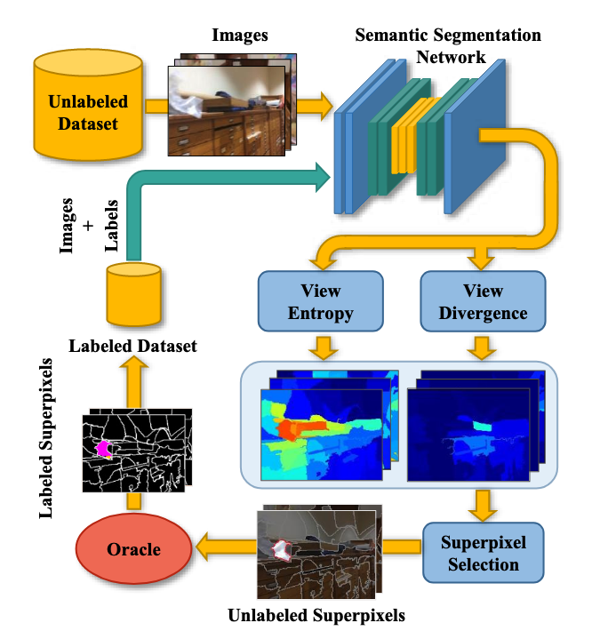

## Abstract

文章中提出ViewAL是一种**主动学习**[^1]策略，对于多视角的图片，研究人员认为这是一个很好的一个非常可靠的不确定性度量方式（reliable measure of uncertainty)[^2]，然后他们将这种reliable measure of uncertainty纳入到视点熵[^3]公式，使之模型可以根据这种reliable measure of uncertainty来训练，调整自己的参数。然后他们还提出超级像素（superpixel）[^4]的不确定性计算方法，降低图片的标注成本。然后证明他们的模型在仅用很小的标注数据的情况下就可以达到95%的性能，用于语义分割。

## Introduction

就是说随着深度学习的发展，就需要更多的数据以及高质量的ground truth data[^5]，但是这有很大的局限性。所以就有了主动学习(active learning)，核心就是根据人们设定的某种策略来让模型主动选择某张图片，然后查询这张图片的标签。最常见的策略就是Uncertainty sampling，意思就是模型选最不确定的样本来查询这张图片的标签。（比如对于一个二元的区分模型，我们选概率最接近0.5的）然后当前Uncertainty sampling的局限就是大多只对单个图片进行，这显然满足不了现实世界这种3D，多视角的情况。

然后研究人员认为现实这种情况，很好的提供了reliable measure of uncertainty，意思就是Uncertainty sampling选最不确定的样本，怎么衡量这种不确定，他们的想法就是同一个物体在不同视角的图片中他的标注应该是一样的，如果模型面对多视角的图片，他不能识别出同一个物体，那么可以说明模型其实不是很确定，判定为预测错误。

因此，研究人员就将这种特性结合到他们提出的视点熵公式中，然后在superpixel的级别上进行不确定度检测，而不是在像素级别上进行检测，意思就是我们不需要对每个像素逐个判断是否值得标注，只需要看哪些“超像素区域”不确定然后就能重点标这些，这样可以节省人力标注成本。


## Related Work

主动学习的策略
#### uncertainty-based approaches

模型选最不确定的样本来查询这张图片的标签
对于一个二元的区分模型，我们选概率最接近0.5的。
对于三元或更多元的区分，可以根据熵来进行判断
$$
H(p)=−\sum^K_{i=1}​p_i​log(p_i)​
$$
```text
模型输出：
[0.33, 0.33, 0.34]
H≈−(3×0.33log0.33)≈1.58
→ 熵高 → 不确定性高 → 模型在迷茫
```
```text
模型输出：
[0.98, 0.01, 0.01]
H=−(0.98log0.98+0.01log0.01+0.01log0.01)≈0.1
→ 熵低 → **不确定性低** → 模型很自信
```
还有比较简单的策略就是，直接看结果中最大的那个概率（最小后验概率），如果这个最大值很小，说明模型对它的预测也不自信。

还有比如选择结果中最大概率和第二大概率中差值最小的
还有利用多个模型对同一组数据进行预测，然后选择最少共识样本的进行标注，就是选择最多模型的预测不同的那一组数据

等等...

## Method

他们的思路就是在一开始利用有标注的图片集对模型进行训练，然后让模型跑没有标注的数据，选择最不确定的超像素进行标注，然后把这个再放到有标注的图片集训练中，再对模型进行训练。如此往复直到所有的数据都进行了标注或者达到标注的预算。

#### Network Training

他们的这个可以用于各种的分割模型中，然后他们选择了DeepLabv3+和MobileNetv2作为backbone[^6]，因为前者的表现最好，后者的训练速度快，内存占用小。然后他们利用在ILSVRC这个数据集进行预训练之后的权重来初始化MobileNetv2，这样可以利用已学到的通用图像特征（如边缘、纹理、颜色等），从而提升模型在下游任务（如语义分割）中的表现。通过这种方式，网络不需要从头开始学习这些特征，能够加速训练并提高精度。然后他们的其他层利用了Kaiming initialization。为了避免过拟合，他们利用模糊、随机裁剪、随机翻转和高斯噪声作为数据增强手段。

#### Uncertainty Scoring

更细一步的流程就是一开始我们有一个ground truth data，里面有很多图片，然后每一个场景都有不同视角的一组图片（比如A，B，C），然后每一张图片都有分好了superpixel以及这个superpixel对应的标签。然后我们将这个ground truth data分成两组，一组用来训练，另外一组用来当作unlabed的数据集进行预测。

然后对于同一个场景，模型对这个场景的那一组包含不同视角的每一张图片（A,B,C）进行预测，会经过20轮的MC dropout[^7]，然后每个图片这时候就会有20种结果，模型跑出来得到的实际上是图片中每一个pixel的在对应标签的概率，然后将这些结果取平均。

然后这时候，我们从这一组跑出来的结果图片中每次选一张，然后将这个图片的每一个像素反投影到3D的空间中，然后再投影到别的视角下的2D的图像，这样子交叉投影（比如我将A的结果反投影到3D的空间，然后再投影到B视角对应的2D图像上，C->B ;B->A ,C->A ;A->C ,B->C）。于是我们就得到多个视角下同一个物体的概率，然后我们根据这些计算视角熵和view divergence。

###### View Entropy Score

再具体说，对于一张图片里面的像素，我们得到其他视角同一个像素投影到该像素的概率，然后我们将这些概率取平均，之后计算视角熵。

D表示MC dropout的总轮数，$P ^{(u,v)}_  i (c)$表示图片 i 经过分割模型后像素(u,v)对于标签 c 的概率，这公式就是将每次MC dropout的结果取平均。
$$
P ^{(u,v)}_  i (c) = \frac 1 D  \sum^D _{d=1}  P ^{(u,v)}  _{i,d} (c),
$$
这个公式的意思就是图片 j 中(x,y)这个像素投影到图片 i 中(u,v)这个像素，然后Ω就是这些像素对应概率的集合。
$$
Ω ^{(u,v )}_  i = \{P ^{(x ,y)}  _j , j | I_j(x, y) cross-projects to I_i(u, v)\}
$$

这个公式就是对图片i中像素（u，v）的概率进行求和
$$
Q ^{(u,v )}_  i =\frac1  {|Ω^ {(u,v)} _ i|}  \sum _{ P ∈Ω ^{(u,v)}  _i}  P ^{(u,v)}
$$

这里就是计算视角熵
$$
VE ^{(u,v)}_  i = −\sum _c  Q^{ (u,v )} _ i (c) log (Q^{(u,v)}_  i (c))
$$

###### View Divergence Score

视角熵表示的其实是某视角预测的“平均”不确定性，但是还没有衡量多个视角预测之间的一致性，况且每个视角下计算出的视角熵应该是一样的。于是文章用Pairwise KL Divergence（成对的KL散度）

KL 散度是一种衡量两个概率分布差异的方式：
$$
D_{KL}(P ∣∣ Q)=\sum_iP(i)log⁡\frac{P(i)}{Q(i)}​
$$

它衡量的是从分布 Q 转向分布 P 所需的信息量差异（不是对称的！）。

然后在文章中的话，这里就计算图片 i 中像素（u，v）的平均的KL散度，高分数得分意味着，平均而言，当前视图中的预测与其他观测点的预测有显著不同
$$
VD ^{(u,v)}_  i =\frac1 { |Ω^{ (u,v)}_  i|}  \sum_  {P_j ∈Ω^{ (u,v)} _ i}  D_{KL}(P ^{(u,v)}_  i ||P ^{(u,v)}_  j )
$$

#### Region Selection

研究人员想的就是让标注者标注的是一个superpixel，因为一个superpixel大多情况下只与一个对象相关联，所以对标注者而言标注相对轻松。这也是不选择矩形来进行标注的原因，然后这里他们这里使用的是[SEEDS](https://scholar.google.com/scholar?hl=zh-CN&as_sdt=0%2C5&q=Michael+Van+den+Bergh%2C+Xavier+Boix%2C+Gemma+Roig%2C+Benjamin+de+Capitani%2C+and+Luc+Van+Gool.+Seeds%3A+Superpixels+extracted+via+energy-driven+sampling.+In+European+conference+on+computer+vision%2C+pages+13–26.+Springer%2C+2012.+5&btnG=)算法进行superpixel分割。

然后他们就计算每一个superpixel的视角熵和View Divergence Score，就是平均该superpixel r 中所有像素的视角熵和View Divergence Score

$$
VE ^r_  i=\frac1 { |r|}  \sum_ { (u,v)∈r}  VE ^{(u,v)}_  i 
$$
$$
VD^ r _ i=\frac 1 { |r|}  \sum _{ (u,v)∈r}  VD^{ (u,v)}_  i 
$$
之后为了挑选出最有价值的那个superpixel，我选择图片 i 中视角熵最大的superpixel，然后我在那一组图片中找所有的和这个superpixel重叠度大于50%的superpixel组成一个集合（包括原本的这个superpixel），然后我在这一组superpixel集合中找最大的那个view divergence，然后把这个选出来要求去标注，然后这张图上的其他superpixel标注为ignored。之后再把这个集合中的所有superpixel都给标注，因为这个集合里的所有superpixel描述的都是一个场景。


这里有一个问题就是，既然这个集合里的所有superpixel描述的都是同一个事物，为什么我不随便从集合中选一个superpixel，然后进行标注，解释就是你只能“看”一个 superpixel 的图像。所以你当然要选一个“最值得你看的”，也就是 View Divergence 最大的那个视角。

#### Label Acquisition

事实上不需要人工标注的参与，用的是ground truth data，可以直接标注上，下一步就是将这些标注了的图片放到labeled dataset中，然后从unlabeled中删除，之后再重新训练网络。


[^1]: **主动学习**： 就是让模型自己“挑问题”问人，把最值得标注的数据交给人类专家来打标签，从而**以更少的数据达到更好的效果**。模型先在未标注数据上做预测，**找出它最不确定的那几张图**（比如分不清是猫还是狗），然后请你给这几张打标签。有利于更快提升模型效果以及节省人工标注成本

[^2]: 大致意思就是根据模型在不同视角下的判断结果，很容易就知道这个模型对某个预测有多自信。举个例子，对于同一个场景的不同视角的几张图片，对于同一个物体，要是模型在不同视角下识别出来的东西不同，那其实就很可以说明模型其实并不是很能“确定“这个物体

[^3]: **视点熵**是计算机图形学、计算机视觉和机器人领域里的一个概念，用于衡量**从某个观察角度观察一个物体时，信息的丰富程度**。比如如果你只看到一个扁扁的正面轮廓（比如只看到背面），信息少 → 熵低。如果你从一个角度能同时看到正面、侧面、腿部细节 → 信息多 → 熵高

[^4]: **superpixel**是图像处理和计算机视觉中的一个重要概念，用来**将图像划分成一些感知上更有意义的区域**，比像素更大，但比完整的物体小。将图像划分成颜色、纹理等相似的小区域，每个 superpixel 通常对应一个局部相似的区域。相比于原始的像素而言，他的优势在于**降低计算量**：原来处理几十万像素，现在只用处理几千个 superpixels。**结构更清晰**：比单独的像素更能表示物体边缘、纹理。**更自然的分割单元**：适合用于图像分割、目标检测、语义分割等任务的预处理。

[^5]: **ground truth data**就是真实标签数据，是我们用来训练和评估模型的“标准答案”，这些从哪里来，很大一部分来自人工的标注。

[^6]: **backbone** 是指一个深度学习模型中负责提取特征（feature extraction）的主干网络部分。有点类似卷积神经网络中的卷积层，但是backbone也不全是CNN，也可以是tramsformer等等。

[^7]: **MC dropout**: **Dropout 是一种防止神经网络过拟合的方法**。它的核心思想就是：在每次训练时，**随机“丢弃”一部分神经元（神经元输出设为 0）**，让模型不会太依赖某些神经元，从而提高泛化能力。**MC dropout**是在“测试阶段”也打开 Dropout，对同一张图片做多次预测，通过预测结果的波动来估计模型的“不确定性”。


