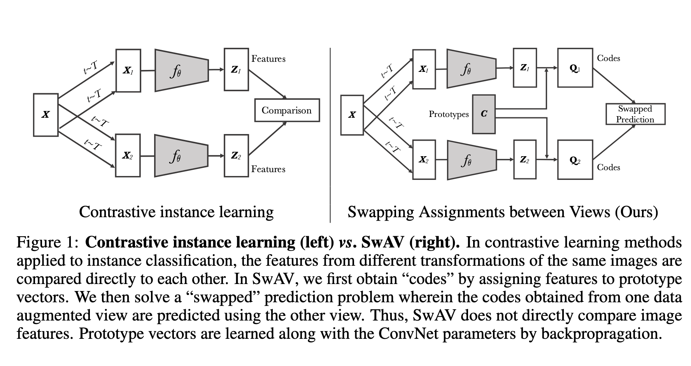

## Introduction

无监督学习以及其中的自监督学习目的是为了不使用人工标签来获得图像的特征，然后他已经迅速的缩小与监督学习之间的差距了。当前的SOTA自监督学习模型主要思想就是instance discrimination(实例判别)，他的主要思想就是我有一组图片，我将这一组图片中的每一张图片定义为一个实例（instance ），然后我将每个实例进行一定的图像变换（如裁剪、颜色变化、模糊等），然后将实例以及它的各种变换版本，都当成一个单独的类别。最终使得模型能够能够区分不同的图片，同时也对图片的一些变换保持一定的不变性（比如旋转、裁剪、颜色变化等，不影响它识别出图片是同一个）。

然后实现这些的主要依赖有两个
1. 对比损失（contrastive loss）
2. 图像转化（ image transformations）
定义两个概念，正样本(Positive sample)和负样本(Negative sample)
正样本就是"should be pull together"的一对，也就是“同一个实例”的两个不同变换版本。
负样本就是"should be push away"的一对，也就是也就是“来自不同实例”的图片。

在实例判别这种训练里，模型的目标就是：
- 把**正样本对**在特征空间里拉得很近（它们是同一个实例，只是有些变化）；
- 把**负样本对**在特征空间里推得很远（它们本来就是不同的实例）。

这样，模型学到的表示就能做到认出“即使样子变化了，还是同一个东西”；同时又能“区分不同的东西”。

然后contrastive loss就是计算正负样本对特征向量的相似度，相当于一个损失函数。

但是有问题就是，我的数据集很大的情况下我给每一个pair计算的话成本就很大，其中一种解决方法就是随机挑一些pair来进行训练。另一种就是就是简化要求，就是我们不区分每一张图片，而是先将图片进行聚类(clustering-based)，而是将具有相似特征的图片分到一个同一组（一个簇）中。然后，模型只需要区分不同簇之间的差异，而不是每张图片之间的差异。有点在于易于计算（即目标是分辨不同簇而非每一张图片），因此在某些情况下，它的目标函数会更**容易优化**。但是这种方法的局限还是计算成本，这是因为聚类方法需要对整个数据集进行遍历，来为每张图片分配一个“编码”（即簇的分配）。这意味着它在训练时必须处理整个数据集，因此随着数据集增大，计算成本也会急剧上升。

## Method

#### SwAV

传统的对比学习方法就是从图片X中进行 image transformations得到$X_1$ $X_2$ 将这些转化后的图片经过$f_θ$神经网络提取出他们的特征向量$Z_1$,$Z_2$，然后进行归一化，然后损失函数就是这两个向量的差异，让同一类图片的特征向量接近，训练的是提取图片特征向量的那一部分神经网络$f_θ$。

然后新的方法是将得出来的特征向量通过Prototypes C映射到code那里，然后使同一类图片的特征向量映射到同一个code那里，训练的是神经网络以及Prototypes C

这里的$z_t$, $z_s$ 就是同一张图片的两张增强版本的特征向量，$q_s$, $q_t$就是对应得到的code，swapped的部分就体现在这里。定义损失函数如下：

$$
  L(z_t, z_s) = \mathcal{L}(z_t, q_s) + \mathcal{L}(z_s, q_t)\tag{1}
$$ 
$$
\ell\left(\mathbf{z}_t, \mathbf{q}_s\right)=-\sum_k \mathbf{q}_s^{(k)} \log \mathbf{p}_t^{(k)} ,\mathbf{p}_t^{(k)}=\frac{\exp \left(\frac{1}{\tau} \mathbf{z}_t^{\top} \mathbf{c}_k\right)}{\sum_{k^{\prime}} \exp \left(\frac{1}{\tau} \mathbf{z}_t^{\top} \mathbf{c}_{k^{\prime}}\right)}\tag{2}
$$
其中$τ$ 是 temperature parameter[^1],然后总的损失函数就如下

$$
-\frac{1}{N} \sum_{n=1}^N \sum_{s, t \sim \mathcal{T}}\left[\frac{1}{\tau} \mathbf{z}_{n t}^{\top} \mathbf{C} \mathbf{q}_{n s}+\frac{1}{\tau} \mathbf{z}_{n s}^{\top} \mathbf{C} \mathbf{q}_{n t}-\log \sum_{k=1}^K \exp \left(\frac{\mathbf{z}_{n t}^{\top} \mathbf{c}_k}{\tau}\right)-\log \sum_{k=1}^K \exp \left(\frac{\mathbf{z}_{n s}^{\top} \mathbf{c}_k}{\tau}\right)\right]
$$

现在我们知道了损失函数长什么样，现在我们就想知道Q怎么来的，文章中写了这样一条式子，每一轮forwarding想要的Q就要满足这样一条式子。
$$
\max _{\mathbf{Q} \in \mathcal{Q}} \operatorname{Tr}\left(\mathbf{Q}^{\top} \mathbf{C}^{\top} \mathbf{Z}\right)+\varepsilon H(\mathbf{Q})\tag{3}
$$
这里的Z是一个batch中所有图片的特征向量的集合，C是所有Prototypes的集合，或者称之为聚类中心。$\mathbf{C}^{\top} \mathbf{Z}$ 就是让Z中的向量和C中所有的向量做内积，换句话说就是每一个特征向量和这些聚类中心做内积，对于这里而言，内积描述了两个向量的相似性，内积越高这两个向量相似性越高。为什么呢，原因就在于内积$\mathbf{a} \cdot \mathbf{b}=\|\mathbf{a}\|\|\mathbf{b}\| \cos \theta$ 而特征向量和Prototypes已经进行了归一化处理，所以他们的内积结果就是$\cos \theta$ ，反映的就是这两个向量的相似性。于是我们就得到了每一个特征向量和聚类中心相似程度的矩阵。

然后，Q相当于一个分配矩阵，$Q_{ij}^{\top}$​表示的就是特征向量 i 分到 prototype j 的概率，那我们当然希望相似程度越高的这两个被分到一起的概率越大，所以就有了$\mathbf{Q}^{\top} \mathbf{C}^{\top} \mathbf{Z}$ 。怎么理解呢，对于$\mathbf{C}^{\top} \mathbf{Z}$这个矩阵，矩阵中的 (i,j) 位置的元素表示为第j个特征向量和第i个prototype的相关性，每一列表示一个特征向量和所有prototype的相关性。这样子和$Q^{\top}$进行内积得到的结果里，每一个对角线上的元素表示$Q^{\top}$中的第i行和$\mathbf{C}^{\top} \mathbf{Z}$中的第i列进行内积，这样子看的话，$Q^{\top}$中每一行的元素就是特征向量 i 分到 prototype j 的概率。同时之后只有对角线上的元素对我们有用，于是计算的是trace。

后面的$\varepsilon H(\mathbf{Q})$ 表示的是Q的熵，目的在于让这个Q变得均匀，熵变大，然后$\varepsilon$就是正则化系数，控制Q均匀的程度，一般设置的很小。

于是乎完整公式的含义就是找到一个Q使得Z更能分配到最接近的prototype C的同时尽量让这个Q更加均匀。

当然这个Q还有一定的限制，这里的限制就是$Q^{\top}$每一行中所有元素相加都是$\frac1B$ ，意思就是对于任意一个特征向量，他属于不同prototype的概率加和应该是1，那这里是$\frac1B$的原因就在于这个Q需要的是归一化的，所以每一行的结果加起来要是1，每一行的结果就应该是$\frac1B$ 。
prototype每一列中所有元素相加都是$\frac1K$ ，意思就是对于任意一个特征向量，他被分到每一个prototype的概率是$\frac1K$，意思就是每个prototype都会有$\frac{B}K$个特征向量。所谓平均分配(equal partition)。
$$
\mathcal{Q}=\left\{\mathbf{Q} \in \mathbb{R}_{+}^{K \times B} \left\lvert\, \mathbf{Q} \mathbf{1}_B=\frac{1}{K} \mathbf{1}_K\right., \mathbf{Q}^{\top} \mathbf{1}_K=\frac{1}{B} \mathbf{1}_B\right\}\tag{4}
$$

现在的问题转化为在这些限制下，我要怎么得到我想要的Q，这就是最优输运问题(Optimal Transport),答案就是[**Sinkhorn-Knopp算法**](https://coderlemon17.github.io/posts/2022/07-16-ot/)来快速求得近似解。这里作者选择的是软编码，意思是一个特征向量可以对应多个prototype，然后根据Sinkhorn-Knopp算法直接给出结果
$$
\mathbf{Q}^*=\operatorname{Diag}(\mathbf{u}) \exp \left(\frac{\mathbf{C}^{\top} \mathbf{Z}}{\varepsilon}\right) \operatorname{Diag}(\mathbf{v})\tag{5}
$$
然后u，v是算法中计算出来的

现在回过头来看他的损失函数就明白这个很有意义，公式(2)中的右边，求的是特征向量$Z_t$和prototype $c_k$ 的softmax概率，相似性越高，这个概率也应该越高，左边$q_s$就是特征向量$Z_s$分到prototype $c_k$的概率，然后求这两个概率的交叉熵如果 q 和 p 很接近，交叉熵就小；如果差得很远，交叉熵就大。

#### multi-crop

对于图像转化问题，他们提出multi-crop，不光做两次大裁剪（大图像区域），他还加上**好几次小裁剪**（很小的局部区域）。这样，一张图片就能变出很多种不同大小、不同范围的视角。

**重点是**：  
因为小裁剪尺寸小，数据量也小，所以即使生成了更多视角，也不会占用太多显存或者增加很多计算量。

**为什么这样做有用？**
- **小视角**（小crop）和**大视角**（大crop）能覆盖一张图像的不同层次的信息，比如小局部细节 vs. 整体布局。
- 如果只用缩小尺寸的图片，特征容易有偏差（就是你只让模型看很小的低分辨率图片，它学出来的特征可能失真）。
- 但是如果用**大小混合**的方法（大crop + 小crop一起用），可以避免这种偏差。
所以原本的损失函数就变成了这样
$$

L\left(\mathbf{z}_{t_1}, \mathbf{z}_{t_2}, \ldots, \mathbf{z}_{t_{V+2}}\right)=\sum_{i \in\{1,2\}} \sum_{v=1}^{V+2} \mathbf{1}_{v \neq i} \ell\left(\mathbf{z}_{t_v}, \mathbf{q}_{t_i}\right) \tag{6}
$$
$1_{v\neq i}​$ 是一个指示函数，当 $v\neq i$ 时，它的值为1，否则为0，表示排除与裁剪i相同的图像。还有值得注意的是这里的code只计算大分辨率crop，小分辨率不计算

---

[^1]: Temperature 控制概率分布的“平滑度”或“尖锐程度”。Temperature越大意味着原本的数变得靠拢，各选项的概率更接近，Temperature越小，原本的数变得越分散，经过指数的加成下，差异就变得越大，分布也就越尖锐